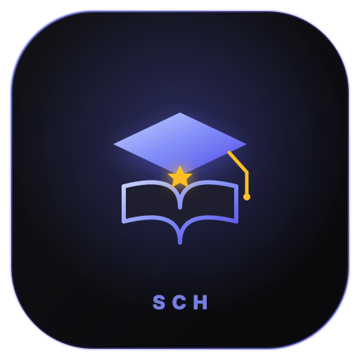

# 📚 SchStudy

<p align="center">
  
  <br />
  <strong>The Sch Suite • Gamified YKS 50k & IELTS 7.0+ Architecture</strong>
</p>

> **Part of The Sch Suite** — YKS mezun senesinde masa başı çalışma disiplinini League of Legends (LoL) ELO/Rank mekanikleriyle oyunlaştıran; Gemini AI karne tarayıcısı, Boss Vault soru mezarlığı ve tek tıkla C1 akademik hazırlığa geçen Dual Engine IELTS 7.0+ pusulası.
>
> *Gamified YKS & IELTS study companion powered by LoL MMR/LP tier mechanics, Gemini Vision exam scorecard OCR, Boss question graveyard, and Next.js 15 PWA architecture.*

[](https://nextjs.org/)
[](https://react.dev/)
[](https://www.typescriptlang.org/)
[](https://tailwindcss.com/)
[](https://deepmind.google/technologies/gemini/)
[](https://www.leagueoflegends.com/)
[](https://web.dev/progressive-web-apps/)
[](https://github.com/schadenfreuds/SchBudget)
[](LICENSE)

---

## ✨ Öne Çıkan Özellikler

### ⚔️ YKS Modu (Hedef 50k & LoL Ranked)
1. **🎮 League of Legends ELO & Rank Sistemi:**
   - Demir'den Şampiyonluk ligine uzanan 10 dereceli küme (`Iron` ➔ `Challenger`).
   - Orijinal Riot Games amblemleri, lig atlama animasyonları, LP kazanımları (+25 ~ 35 LP) ve 100 LP'de promosyon serileri (BO3 / BO5).
   - Günlük çalışma serisi alevi (**On Fire / Win Streak 🔥**) ve hareketsizlik erime (decay) uyarıları.
2. **📸 AI Sınav Karnesi Tarayıcısı (Gemini Vision Multimodal OCR):**
   - Deneme kulübü veya kurum karnesinin fotoğrafını çekip yükleme.
   - Gemini Vision yapay zeka tabloyu 2 saniyede okur; Türkçe, Sosyal, Matematik, Fen ve AYT branş netlerini forma otomatik döker.
3. **🎯 50k Zümrüt Referans Çizgisi:**
   - 2026 başlangıç tabanından (77.5 TYT / 49.5 AYT) ilk 50k hedef çizgisine (95.0 TYT / 62.0 AYT) olan mesafeyi gerçek zamanlı gösteren performans barı.
4. **💀 Boss Vault (Soru Mezarlığı & Rövanş Sistemi):**
   - Denemelerde ve soru bankalarında seni "kesen" soruları Boss olarak kaydetme (*Örn: Geometri - Çemberde Teğet-Kiriş*).
   - Durum takibi: `Defeated by Boss` ➔ `In Battle` ➔ `Boss Slain!` (Boss katledildiğinde +15 LP ödülü).
5. **⏱️ Grind Etüt Sayacı (Minion Farm):**
   - 25, 45 veya 60 dakikalık odaklı kütüphane / masa başı sayacı. Tamamlanan her odak seansı için +10 LP farming ödülü.

---

### 🌍 Dual Engine: IELTS 7.0+ Modu (Avrupa & İtalya Şartı)
Üst bardaki tek tıkla çalışan mod anahtarı (`[ ⚔️ YKS | 🌍 IELTS ]`) ile tüm uygulama bağlamını global akademik hazırlığa çevirir:

1. **📊 4 Ayaklı Band Radarı & Overall Gauge:**
   - Listening, Reading, Writing ve Speaking branş skorları.
   - Resmi IELTS yuvarlama kuralıyla (.25 ve .75 kuralı) hesaplanan hedef göstergesi (Hedef: Band 7.0+).
2. **📖 Cambridge IELTS Deneme Takipçisi:**
   - Cambridge 10-19 denemeleri için 40 soru üzerinden doğru sayısı girişi; anında resmi Band dönüşümü (örn: 33 doğru = Band 7.5).
3. **🧠 Academic Lexicon (C1 / C2 Kelime Kasası):**
   - C1 seviyesi akademik kelimeler, fonetik telaffuzlar, İngilizce/Türkçe tanımlar, bağlam içi örnek cümleler ve collocation eşleştirmeleri.
   - Çevirmeli kart (flip card) ve "Öğrenildi" hafıza takibi.
4. **⏳ Resmi Sınav Kronometreleri:**
   - **Speaking Part 2:** 1 dakika resmi hazırlık + 2 dakika konuşma simülasyonu (Örnek cue card ile).
   - **Writing Task 1 & 2:** 20 ve 40 dakikalık resmi süre sayaçları ve yönergeler.

---

## 🏛️ Mimari & Standartlar

- **Framework:** Next.js 15 (App Router) + React 19 + TypeScript 5
- **Tasarım:** Tailwind CSS v4 + The Sch Suite Standardı (Royal Indigo `#6366f1` + Obsidian `#09090b` + Squircle rx="116")
- **Oyunlaştırma:** LoL Matchmaking Rating (MMR) ELO & Tier State Machine
- **Yapay Zeka:** Google Gemini 2.0 Flash Multimodal Vision API
- **Çevrimdışı & Güvenlik:** %100 LocalStorage öncelikli (Offline-First), sıfır harici gecikme
- **PWA:** `manifest.json` + Service Worker uyumlu; mobil cihazlarda ana ekrana tam ekran uygulama olarak eklenir

---

## 🚀 Hızlı Başlangıç

1. Depoyu klonlayın:
   ```bash
   git clone https://github.com/schadenfreuds/SchStudy.git
   cd SchStudy
   ```
2. Bağımlılıkları yükleyin:
   ```bash
   npm install
   ```
3. `.env.local` dosyasını oluşturup Gemini API anahtarınızı ekleyin:
   ```env
   GEMINI_API_KEY=your_gemini_api_key_here
   ```
4. Geliştirme sunucusunu başlatın:
   ```bash
   npm run dev
   ```
5. Tarayıcınızda `http://localhost:3000` adresini açın.

---

## 👑 The Sch Suite Ailesi

- **SchBudget:** Aile & Kişisel Bütçe, Sabit Faturalar, Günlük Pusula (PWA)
- **SchFit:** Android Kotlin Native Egzersiz, Tonaj & Kilo Pusulası
- **SchStudy:** Gamified YKS 50k & IELTS 7.0+ Odak ve Deneme Pusulası
- **SchBrain:** CanOS Vault & 7/24 Otopilot Kişisel Komuta Merkezi (HUD)

---

## 📄 Lisans
Bu proje [MIT](LICENSE) lisansı altında sunulmaktadır.
